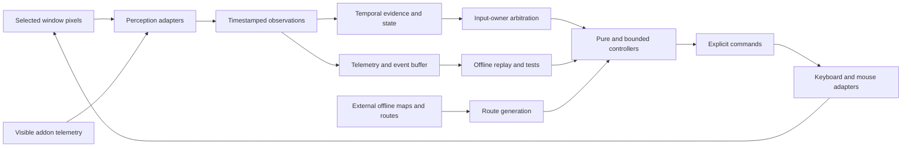

# Screen Vision Agent

A Windows-focused, replay-oriented visual autonomy project for a legacy game
environment. The agent observes captured pixels and visible UI telemetry,
maintains temporal state, plans bounded actions, and verifies visible
postconditions. It does not rely on process-memory reading, code injection,
packet inspection or hidden server state.

This repository is a privacy-safe portfolio snapshot of a longer research and
engineering project. Raw gameplay media, client-derived assets, model weights,
navigation extracts, account data and machine-specific configuration are not
included. The committed configuration is offline and input-disabled by
default.

## Engineering highlights

- A timestamped perception-to-action pipeline with explicit unknown states.
- Deterministic route progress tracking that rejects backward jitter and
  physically close but logically incorrect loop segments.
- Continuous forward motion with bounded, proportional right-mouse yaw.
- Arbitration that permits one input owner per controller tick.
- Evidence-gated interaction: ML detections propose candidates, while visible
  cursor, tooltip and state-transition evidence authorizes actions.
- Serialized combat scheduling with priority and minimum key gaps.
- Bounded obstacle, death and modal-dialog recovery state machines.
- Event telemetry, replay analysis, dataset tooling and more than 770 offline
  regression tests in the source project.

The sanitized portfolio snapshot currently passes 765 tests; 35 tests are
explicitly skipped because their private screenshots, cursor artwork or
external navigation inputs are deliberately not redistributed.

The latest retained route artifact contains 488 waypoints and a hazard-audited
cyclic plan. Recorded development evidence includes one fully verified
autonomous gather transaction and repeated end-to-end resurrection recovery.
Mining repeatability and uninterrupted full-cycle autonomy remain active
limitations rather than completed claims.

## Architecture



The key design rule is that an uncertain observation is not treated as an
absence. High-consequence transitions require temporally stable, visible
evidence, and every probing action has a timeout and attempt budget.

See [Architecture](docs/ARCHITECTURE.md), [Technology overview](docs/TECHNOLOGY_OVERVIEW.md)
and [Engineering evidence](docs/ENGINEERING_HIGHLIGHTS.md) for details.

## Repository map

```text
src/vision_bot/       production perception, state and controller modules
scripts/              route, dataset, model and run-analysis tooling
tests/                unit, replay and regression tests
addons/               visible UI telemetry addon written in Lua
data/routes/          generated route artifacts and synthetic fixtures
examples/             safe offline examples with no OS input
docs/                 architecture, technology and portfolio boundaries
```

## Quick start

Python 3.10 or newer is required. Windows is required for the live capture and
input adapters; the route replay and most pure controller tests are portable.

```powershell
py -3.11 -m venv .venv
.\.venv\Scripts\Activate.ps1
python -m pip install --upgrade pip
python -m pip install -e ".[dev]"
pytest -q
python examples\offline_route_replay.py
```

The example emits accepted progress, cross-track distance and steering targets
for a synthetic route. It never locates a client window or sends input.

Optional ML tooling can be installed with:

```powershell
python -m pip install -e ".[ml]"
```

Model weights and training media are intentionally external. Tests replace
heavy ML models with deterministic fakes where controller behavior, not model
accuracy, is under test.

## Safety boundary

`config.yaml` is a safe portfolio configuration:

- input is disabled;
- route-live behavior is disabled;
- mining, combat and recovery are disabled;
- external maps, navmeshes and weights are not bundled.

Local experiments should use an ignored `config.local.yaml`. Any live use must
be explicitly authorized, supervised and configured for the intended window.
See [SECURITY.md](SECURITY.md).

## What is deliberately omitted

- screenshots, videos and raw live-run artifacts;
- personal account names and local user paths;
- client archives, cursor artwork, ADT/DBC/map/navmesh extracts;
- third-party spawn databases;
- trained `.pt` weights and raw training datasets;
- internal chat handoffs and historical operational reports.

The small `data/MiningData.lua` file is synthetic test data. Retained JSON
routes are generated project outputs; their external source inputs are not
redistributed. See [Portfolio scope](docs/PORTFOLIO_SCOPE.md) and
[Third-party notices](THIRD_PARTY_NOTICES.md).

## Current limitations

- The live coordinator still contains large modules that are being split into
  observation, pure controller, execution and telemetry layers.
- One verified mining transaction does not yet establish repeatability.
- Full route coverage, multi-enemy combat and post-recovery route resume still
  require broader live evidence.
- External model and navigation artifacts are required for the complete local
  research setup and are not part of this portfolio snapshot.

## License

Original code in this repository is available under the MIT License. External
dependencies, game names and any user-supplied data retain their own licenses
and rights.
