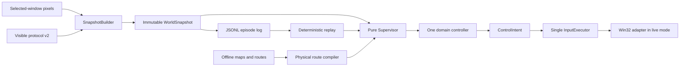

# Screen Vision Agent

A Windows-focused, replay-oriented visual autonomy project for a legacy game
environment. The agent observes captured pixels and visible UI telemetry,
maintains temporal state, plans bounded actions, and verifies visible
postconditions. It does not rely on process-memory reading, code injection,
packet inspection or hidden server state.

This repository is a privacy-safe v0.9.2 portfolio snapshot of a longer
research and engineering project. Raw gameplay media, client-derived assets,
model weights, navigation extracts, account data and machine-specific
configuration are not included. The committed configuration defaults to
deterministic replay and has a separate deny-by-default portfolio input gate.

## Engineering highlights

- One immutable, timestamped `WorldSnapshot` per frame with explicit unknown
  and freshness semantics.
- A pure priority supervisor that selects exactly one domain owner per tick.
- Domain controllers that return explicit `ControlIntent` command schedules.
- One generation-aware, nonblocking input executor that cancels stale work and
  reconciles held keys/buttons.
- Replay, shadow and explicitly gated live modes through one CLI and kernel.
- A checksummed visible telemetry protocol with rolling frame/event sequences.
- Deterministic route progress tracking that rejects backward jitter and
  physically close but logically incorrect loop segments.
- Continuous forward motion with bounded, proportional right-mouse yaw.
- Evidence-gated interaction: ML detections propose candidates, while visible
  cursor, tooltip and state-transition evidence authorizes actions.
- Serialized combat scheduling with priority and minimum key gaps.
- Bounded obstacle, death and modal-dialog recovery state machines.
- Event telemetry, replay analysis, dataset tooling and more than 880 automated
  tests in this public snapshot.

The sanitized portfolio snapshot currently passes 885 tests; 35 tests are
explicitly skipped because their private screenshots, cursor artwork or
external navigation inputs are deliberately not redistributed.

The latest V19 artifact stores 304 route entries (303 normalized physical
points), 74 planned nodes and 73 effective candidates after permanent
exclusions. Its all-hazard compile is clean, but it remains explicitly marked
as an offline candidate rather than a production-accepted route. Recorded
development evidence includes one fully verified
autonomous gather transaction and repeated end-to-end resurrection recovery.
Mining repeatability and uninterrupted full-cycle autonomy remain active
limitations rather than completed claims.

## Architecture



The key design rule is that an uncertain observation is not treated as an
absence. High-consequence transitions require temporally stable, visible
evidence, and every probing action has a timeout and attempt budget.

See [v0.9 architecture](docs/V09_ARCHITECTURE.md),
[Architecture](docs/ARCHITECTURE.md),
[Technology overview](docs/TECHNOLOGY_OVERVIEW.md) and
[Engineering evidence](docs/ENGINEERING_HIGHLIGHTS.md) for details.

## Repository map

```text
src/vision_bot/       production perception, state and controller modules
scripts/              route, dataset, model and run-analysis tooling
tests/                unit, replay and regression tests
addons/               visible UI telemetry addon written in Lua
data/routes/          generated route artifacts and synthetic fixtures
examples/             safe offline examples with no OS input
docs/                 architecture, technology and portfolio boundaries
```

## Quick start

Python 3.10 or newer is required. Windows is required for the live capture and
input adapters; the route replay and most pure controller tests are portable.

```powershell
py -3.11 -m venv .venv
.\.venv\Scripts\Activate.ps1
python -m pip install --upgrade pip
python -m pip install -e ".[dev]"
python -m pytest -q
screen-vision-agent --help
python examples\offline_route_replay.py
```

The example emits accepted progress, cross-track distance and steering targets
for a synthetic route. It never locates a client window or sends input.

Optional ML tooling can be installed with:

```powershell
python -m pip install -e ".[ml]"
```

Model weights and training media are intentionally external. Tests replace
heavy ML models with deterministic fakes where controller behavior, not model
accuracy, is under test.

## Safety boundary

`config.yaml` is a safe portfolio configuration:

- `v09.default_mode` is `replay`;
- `portfolio.allow_live_input` is `false`;
- the v0.9 `live` command also requires an explicit enable flag and a fresh
  matching preflight manifest;
- route-live behavior is disabled;
- mining, combat and recovery are disabled;
- external maps, navmeshes and weights are not bundled.

Local experiments should use an ignored `config.local.yaml`. Any live use must
be explicitly authorized, supervised and configured for the intended window.
See [SECURITY.md](SECURITY.md).

## What is deliberately omitted

- screenshots, videos and raw live-run artifacts;
- personal account names and local user paths;
- client archives, cursor artwork, ADT/DBC/map/navmesh extracts;
- third-party spawn databases;
- trained `.pt` weights and raw training datasets;
- internal chat handoffs and historical operational reports.

The small `data/MiningData.lua` file is synthetic test data. Retained JSON
routes are generated project outputs; their external source inputs are not
redistributed. See [Portfolio scope](docs/PORTFOLIO_SCOPE.md) and
[Third-party notices](THIRD_PARTY_NOTICES.md).

## Current limitations

- V0.9's deterministic runtime is implemented, but its latest route, guarded
  mining transaction and post-fix combat behavior still need broader live
  acceptance.
- One verified mining transaction does not yet establish repeatability.
- Full route coverage, multi-enemy combat and post-recovery route resume still
  require broader live evidence.
- External model and navigation artifacts are required for the complete local
  research setup and are not part of this portfolio snapshot.

## License

Original code in this repository is available under the MIT License. External
dependencies, game names and any user-supplied data retain their own licenses
and rights.
