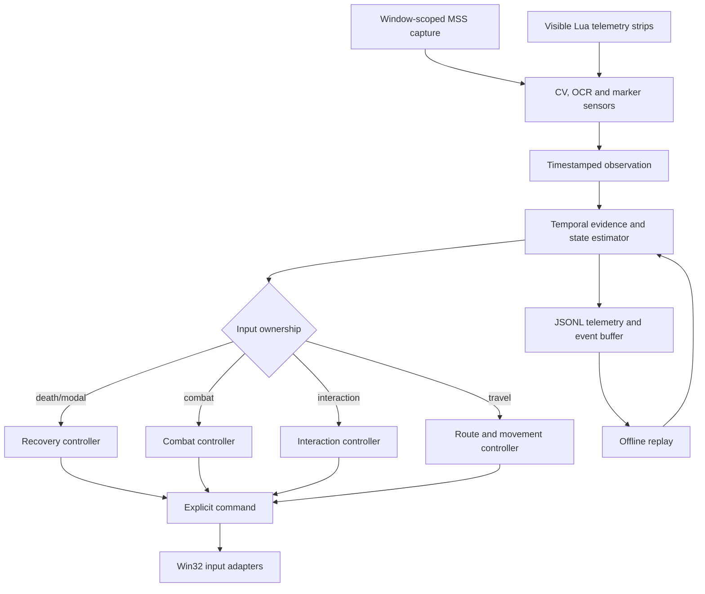

# Architecture

## Runtime pipeline

Capture and input are adapters. State transition logic receives observations
and returns commands, which makes the behavior testable without controlling a
real window.

## Perception

The project intentionally uses different techniques for different signal
types:

- fixed UI geometry: calibrated regions and color/template matching;
- coordinates and finite text: template OCR with Tesseract fallback;
- ore and object proposals: OpenCV plus optional YOLO inference;
- player state and game events: fixed visible addon markers;
- state changes: temporal evidence across multiple observations.

Every sensor result is expected to carry presence state, confidence, age and
source. `unknown` is distinct from `absent`.

## Navigation

Global route geometry is precomputed from external offline references. Runtime
localization still comes from visible screen coordinates. The directed route
follower projects observations onto a cyclic polyline, unwraps progress across
the lap boundary and rejects implausible regression or forward jumps.

Normal movement holds forward continuously. Heading corrections use bounded
right-mouse drags proportional to visible heading error. Local recovery starts
with a jump, escalates to a committed side and finally performs a bounded hard
escape. Hazard polygons prevent both planning and accepted/raw runtime
coordinates from entering known unsafe geometry.

## Interaction and safety gates

An object detector never authorizes a click by itself. A candidate must pass a
sequence of visible gates such as minimap persistence, native tooltip identity,
route-database compatibility, safe approach geometry, cursor evidence and a
post-click state change. Failed transactions have cooldowns and attempt limits.

Combat actions are serialized. Higher-priority health protection preempts
periodic actions, and no two combat keys may overlap. Recovery is likewise a
visible state machine rather than a blind click sequence.

## Observability and replay

Each controller tick records relevant observation summaries, active state,
selected owner, command, reason and timing. Expensive visual artifacts are
stored only around important events. Analysis scripts reconstruct route
progress, cross-track error, interaction attempts, combat schedules and state
transitions without repeating a live run.

