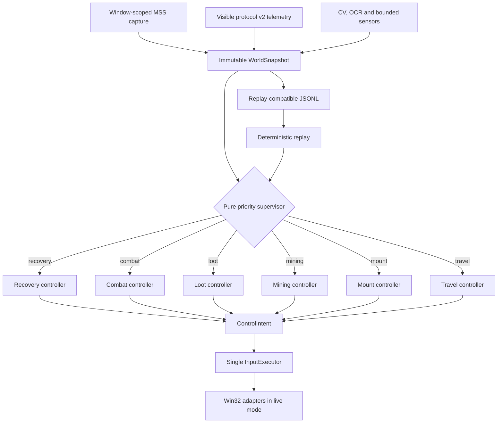

# Architecture

## Runtime pipeline

Capture and input remain adapters. The supervisor and domain controllers are
pure state transitions over immutable evidence. They cannot capture a frame,
sleep or press a key, so the same kernel runs in tests, replay, shadow and live
modes.

The executor is the only side-effect owner. It serializes scheduled commands,
tracks held keys/buttons, rejects stale generations and immediately reconciles
input on preemption. Shadow mode never constructs it.

## Perception

The project intentionally uses different techniques for different signal
types:

- fixed UI geometry: calibrated regions and color/template matching;
- coordinates and finite text: template OCR with Tesseract fallback;
- ore and object proposals: OpenCV plus optional YOLO inference;
- player state and game events: fixed visible addon markers;
- state changes: temporal evidence across multiple observations.

Every sensor result carries presence state, confidence, observation time,
frame and source. `unknown` is distinct from `absent`; stale protocol withdraws
route/mining authority instead of inventing negative evidence.

The visible Lua strip uses protocol v2: version, rolling frame sequence,
coordinates, heading, event sequence, status flags and checksum. That makes a
frozen but visually valid overlay detectable from pixels alone.

## Navigation

Global route geometry is precomputed from external offline references and
compiled into physical yards. Runtime localization still comes from visible
screen coordinates. The compiler rejects hazardous points, segments, mining
nodes and access options and applies permanent exclusions before controller
construction. The directed follower projects observations onto a cyclic
polyline, unwraps progress across the lap boundary and rejects implausible
regression or forward jumps.

Normal movement holds forward continuously. Heading corrections use bounded
right-mouse drags proportional to visible heading error. Local recovery starts
with a jump, escalates to a committed side and finally performs a bounded hard
escape. Hazard polygons prevent both planning and accepted/raw runtime
coordinates from entering known unsafe geometry.

## Interaction and safety gates

An object detector never authorizes a click by itself. A candidate must pass a
sequence of visible gates such as minimap persistence, native tooltip identity,
route-database compatibility, safe approach geometry, cursor evidence and a
post-click state change. Failed transactions have cooldowns and attempt limits.

Combat actions are serialized. Higher-priority health protection preempts
periodic actions, and no two combat keys may overlap. Recovery is likewise a
visible state machine rather than a blind click sequence.

## Observability and replay

Each controller tick records the snapshot summary, selected owner, intent,
reason, state transition and timing. Replay feeds recorded snapshots back into
the production kernel and checks deterministic digests plus safety invariants.
Expensive visual artifacts are stored only around important events. Analysis
scripts reconstruct route progress, cross-track error, interaction attempts,
combat schedules and state transitions without repeating a live run.
